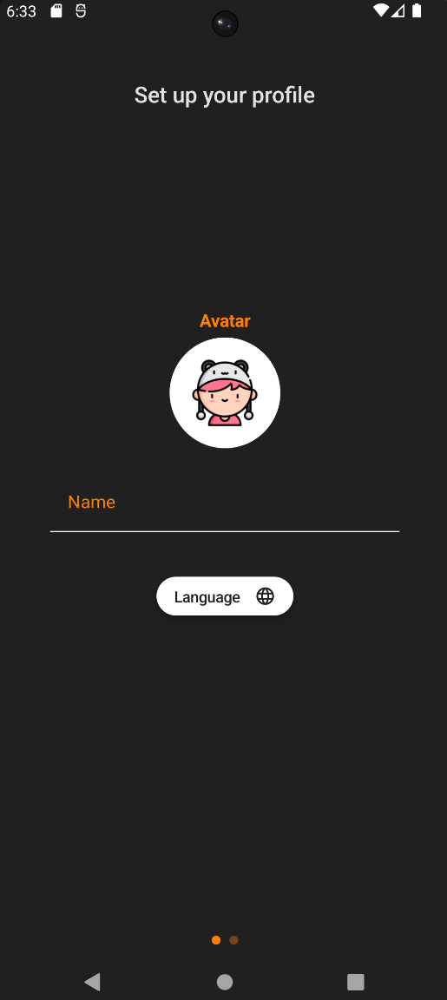
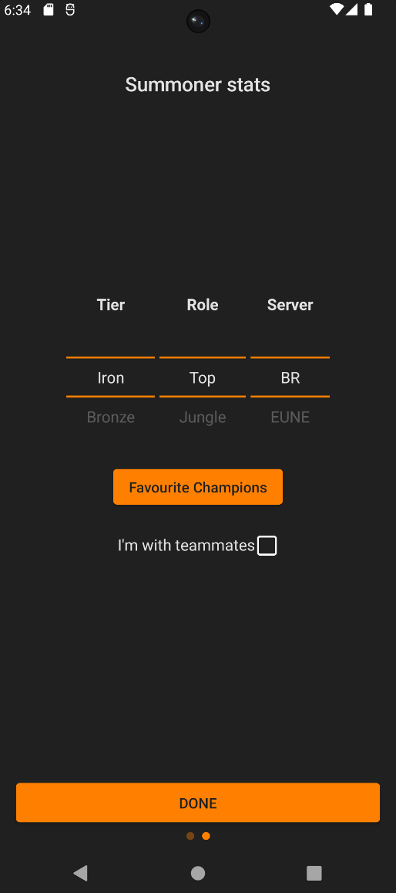
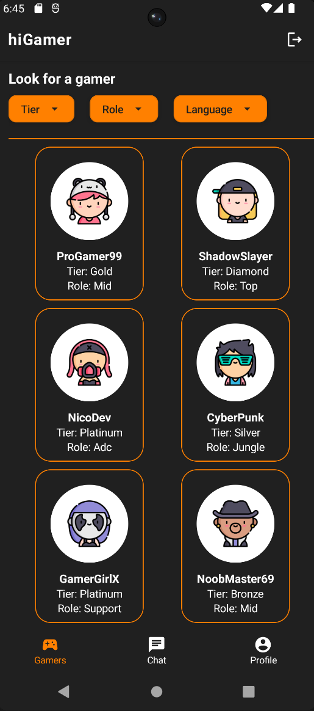
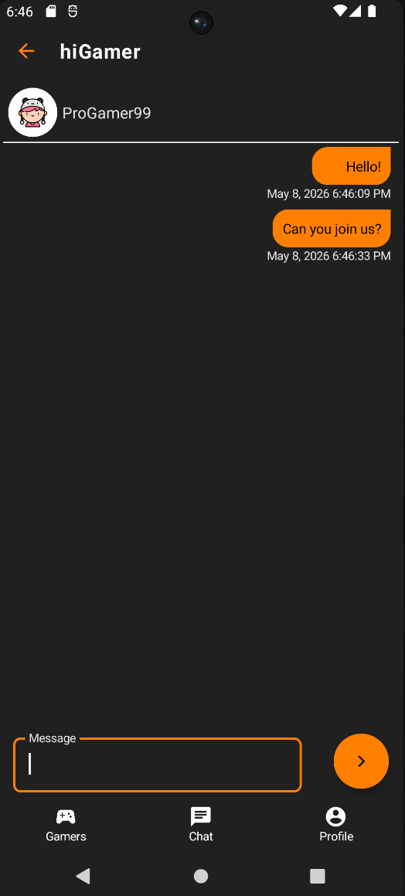
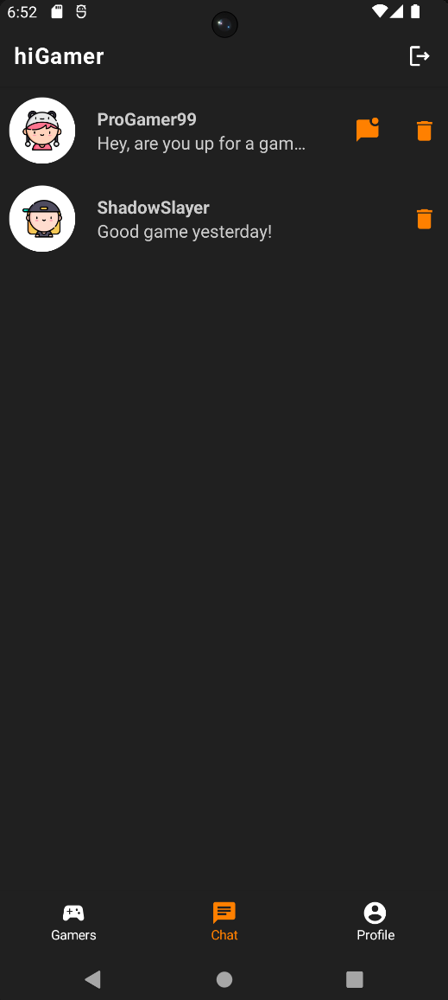

  <h1 align="center">🎮 hiGamer (2021)</h1>

**hiGamer** is a mobile application designed for *League of Legends* players to find teammates based on specific criteria such as role, nationality, and in-game rank. The goal is to facilitate the formation of full 5-player teams through a streamlined matchmaking and real-time communication system.

> **Note:** I personally developed the **Frontend-side (Android Client)** for this project, including the logic for data integration and real-time synchronization. The Firebase backend infrastructure was managed and provided by a collaborator.

---

## 🚀 Features
*   **User Profiling:** Users can set up their profile by selecting their main game role (Top, Jng, Mid, Adc, Supp), nationality, and current rank.
*   **Smart Matchmaking:** A dedicated homepage displays a curated list of players that match the user's preferences.
*   **Real-time Chat:** Direct 1-to-1 messaging system to coordinate play sessions.
*   **Chat History:** A dedicated section to manage and resume ongoing conversations.
*   **Push Notifications:** Instant alerts for incoming messages to ensure quick coordination.

## 🛠 Tech Stack (Frontend)
### Frontend Architecture
*   **Language:** Kotlin
*  Architecture: MVVM (Model-View-ViewModel)
*  UI Framework: Jetpack Compose 
*  Asynchronous Operations: Kotlin Coroutines 
*   **NoSQL Real-time Sync:** Implemented Firebase Realtime Database to handle instant messaging
*   **Asynchronous Operations:** Handled real-time listeners to ensure the UI updates instantly when a new message arrives or a new player joins the pool.
*   **Authentication Flow:** Implemented a secure User Lifecycle (Registration -> Profile Setup -> Matchmaking) using Firebase Auth.

---

## 📸 Screenshots
| Profile Page 1 | Profile Page 2 | Gamers List | Chat Screen | Chat List |
| :---: | :---: | :---: | :---: | :---: |
|  |  |  |  | 
---

**Current Status:** This project is in a **Legacy/Archive** state. It was developed as a collaborative personal project.
